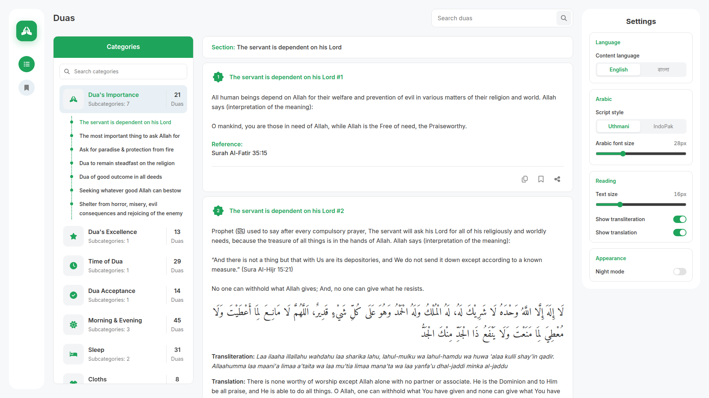
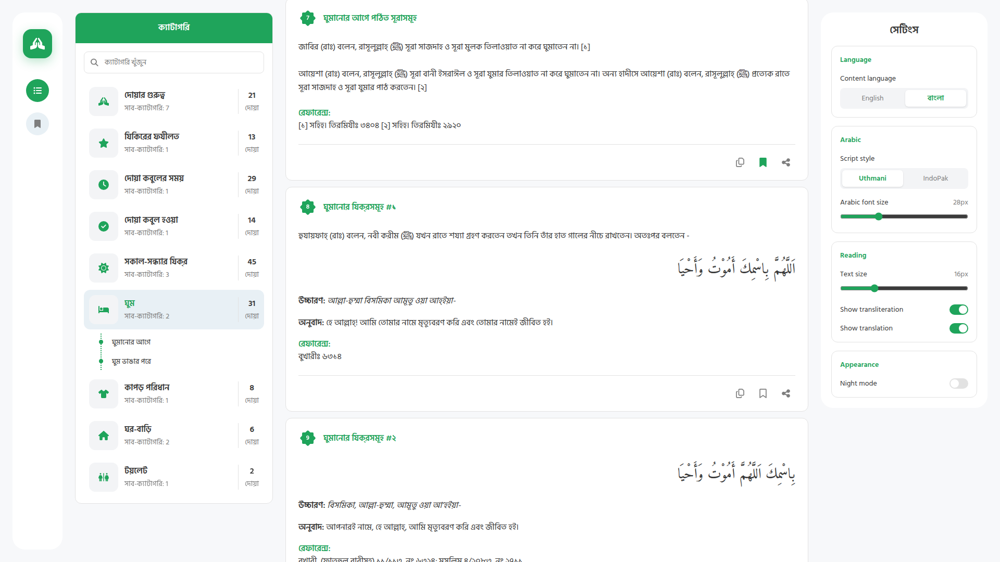
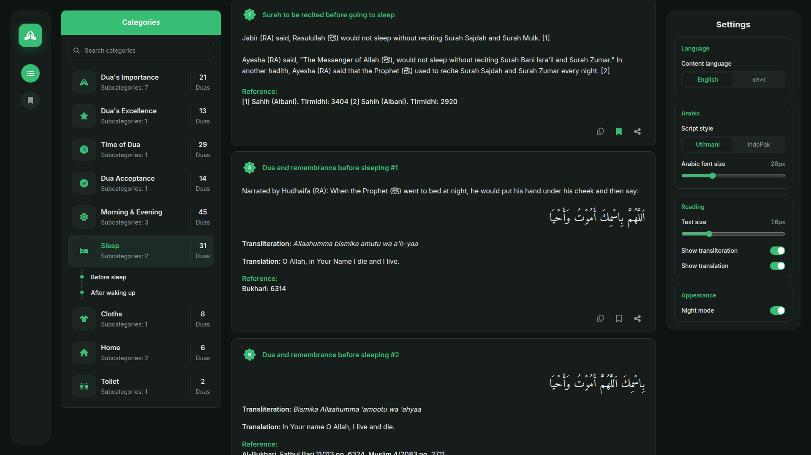
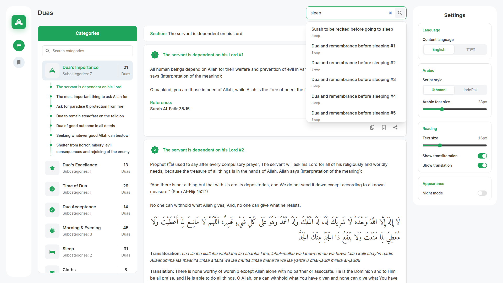
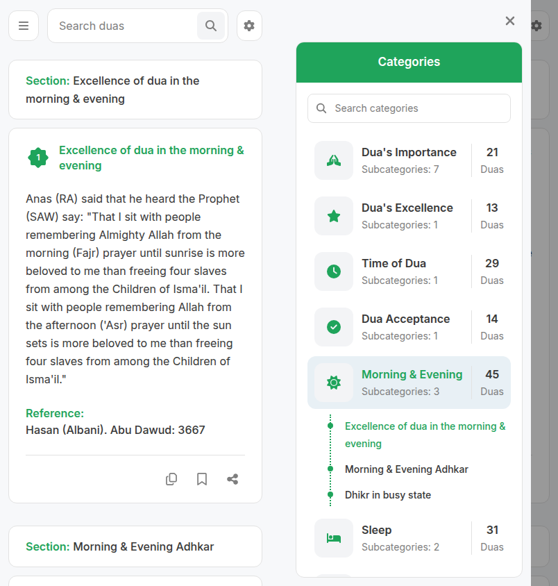
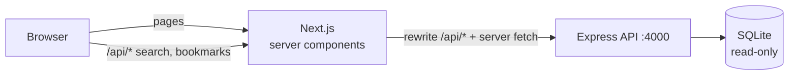

# Dua Web App

[](https://github.com/salehinafnan/dua-web-app-front-end/actions/workflows/ci.yml)

A full-stack app for reading duas (Islamic supplications) by category. Each
dua shows the Arabic text, a transliteration and a translation in English or
Bangla, with its hadith or Qur'an reference and recitation audio. You can
search, bookmark and adjust the reader to your preferences.

**Next.js 16 · React 19 · Tailwind CSS 4 · Express 5 · SQLite (better-sqlite3)**



| Bangla                     | Night mode             |
| -------------------------- | ---------------------- |
|  |  |

| Search                     | Mobile                     |
| -------------------------- | -------------------------- |
|  |  |

## Features

- **10 categories, 23 sections, 176 duas**, all served from the bundled
  SQLite database.
- **Category sidebar** with filtering and a subcategory timeline that
  highlights the section you're reading.
- **Full-text search** across titles, intros, translations, transliterations
  and the Arabic text, in English or Bangla. Results that match the title are
  listed first.
- **Reader settings** that persist across visits: English or Bangla content,
  Uthmani or IndoPak Arabic script, Arabic and body font sizes, toggles for
  transliteration and translation, and night mode. Settings apply before the
  first paint, so the page never flashes the wrong theme or language.
- **Bookmarks** saved in the browser, with a dedicated page.
- **Per-dua actions**: play or pause the recitation (only one plays at a
  time), copy the full text in the current language, and share a deep link
  like `/duas/6#dua-206`.
- **Responsive**. On smaller screens, categories and settings open in
  drawers.
- **Accessible**. Controls are real buttons with labels, drawers close with
  Esc, and status changes are announced.

## Architecture



- Pages are **server-rendered**. The Next.js server fetches the data from the
  API, so a page arrives with its content already in it.
- The browser only calls the API for search and bookmarks, and it does so
  through Next's `/api/*` rewrite. That means the browser never needs CORS
  and never sees the API's address.
- Reader preferences are applied as `data-*` attributes and CSS variables on
  `<html>`. The dua cards render both languages and both scripts, and CSS
  shows the selected ones. This keeps the cards server components and avoids
  a hydration flash when the page loads.

## Getting started

Requires Node 20.9 or later.

```bash
npm run setup     # installs root, server and client dependencies
npm run dev       # API on http://localhost:4000, web app on http://localhost:3000
```

Other scripts:

```bash
npm test          # API test suite
npm run build     # production build of the client
npm start         # run the API and the built client
```

### Configuration

| Variable      | Used by | Default                           | Purpose                                   |
| ------------- | ------- | --------------------------------- | ----------------------------------------- |
| `API_URL`     | client  | `http://localhost:4000`           | Where Next.js fetches and proxies the API |
| `PORT`        | server  | `4000`                            | API port                                  |
| `CORS_ORIGIN` | server  | `*`                               | Comma-separated allowed origins           |
| `DB_PATH`     | server  | `server/database/dua_main.sqlite` | Alternative database file                 |

## API

All responses are JSON. The dataset is static, so responses are cacheable.

| Endpoint                  | Returns                                                                 |
| ------------------------- | ----------------------------------------------------------------------- |
| `GET /api/categories`     | Categories, each with its subcategories and real dua counts             |
| `GET /api/categories/:id` | One category with every dua nested under its subcategory                |
| `GET /api/duas/:id`       | One dua                                                                 |
| `GET /api/duas?ids=1,2,3` | Several duas, in the order requested (up to 100)                        |
| `GET /api/search?q=…`     | Up to 20 matches, title matches first (`q` needs at least 2 characters) |
| `GET /health`             | `{ "ok": true }`                                                        |

A dua looks like this:

```jsonc
{
  "id": 123,
  "categoryId": 5,
  "subcategoryId": 12,
  "title": { "en": "Tasbeeh", "bn": "তাসবীহ" },
  "intro": { "en": "After Fajr and Asr prayer, …", "bn": "…" },
  "passages": [
    {
      "arabic": "سُبْحَانَ اللَّهِ",
      "indopak": "سُبْحَانَ اللّٰهِ",
      "transliteration": { "en": "Sub’hanallah", "bn": "…" },
      "translation": { "en": "How perfect Allah is", "bn": "…" },
      "reference": { "en": null, "bn": null },
    },
    // …more passages
  ],
  "note": { "en": null, "bn": null },
  "audio": "http://www.ihadis.com/duaaudiofinal/94.mp3",
}
```

### Data notes

Working with the raw database surfaced a few quirks, which the API now
handles:

- **Multi-part duas.** Some duas are stored as several rows that share one
  `id`. For example, _Tasbeeh_ is five rows: SubhanAllah, Alhamdulillah,
  Allahu Akbar, and so on. Only the first row has the title. The API merges
  these rows into one dua with a `passages` array.
- **Stored counts were wrong.** The `no_of_dua` totals don't match the
  data. For example, _Morning & Evening_ claims 53 duas but has 45. The API
  now calculates the counts from the data.
- **Mixed Unicode in Bangla.** The Bangla text mixes precomposed and
  decomposed forms of the same letters, such as `য়`. Searching for `দোয়া`
  could return nothing, depending on how it was typed. All text is now
  NFC-normalised, and search compares normalised strings. The user's input is
  matched literally, with `%` and `_` escaped.
- **Bloated file.** 91% of the SQLite file was free pages. `VACUUM` shrank it
  from 6.7 MB to 0.6 MB, with identical data.

## Project structure

```
├── client/                      Next.js app (App Router)
│   ├── app/
│   │   ├── (reader)/            shared layout: icon rail, categories, settings
│   │   │   ├── duas/[categoryId]/
│   │   │   └── bookmarks/
│   │   ├── layout.jsx           fonts + pre-paint settings script
│   │   └── globals.css          theme tokens, reader CSS
│   ├── components/              DuaCard, CategoryPanel, SearchBox, SettingsPanel, …
│   └── lib/                     API client, settings & bookmark stores
├── server/                      Express API
│   ├── src/{app,repository,db,index}.js
│   ├── test/api.test.js
│   └── database/dua_main.sqlite
└── docs/                        screenshots
```

## History

This began in March 2024 as a take-home assignment modelled on the
[Dua & Ruqyah](https://duaruqyah.com) app. The first version was a static
page of absolutely-positioned markup generated from the design. The content
was hard-coded, including a fake user ("MD. Mahmud"). The Express API
existed, but the page never called it. Search, settings and buttons did
nothing. Even the API had problems: `throw err` inside a sqlite callback
would crash the server, the database path only worked from one folder, and
the client and server both defaulted to port 3000.

The 2026 rewrite keeps the original visual design and makes the app actually
work.

## Credits

The dua content in `server/database` comes from the database supplied with
the original assignment. That includes the Arabic text, translations,
transliterations, references and the audio links hosted on ihadis.com. All
content belongs to its original publishers. This is a non-commercial
learning project.

Audio links use plain `http://`. When the app is served over HTTPS, browsers
may block them as mixed content.

## License

The code is released under the [MIT license](LICENSE). The license does not
cover the dua content.
